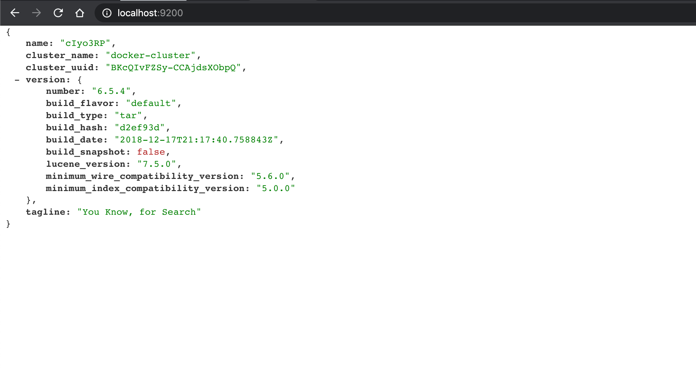
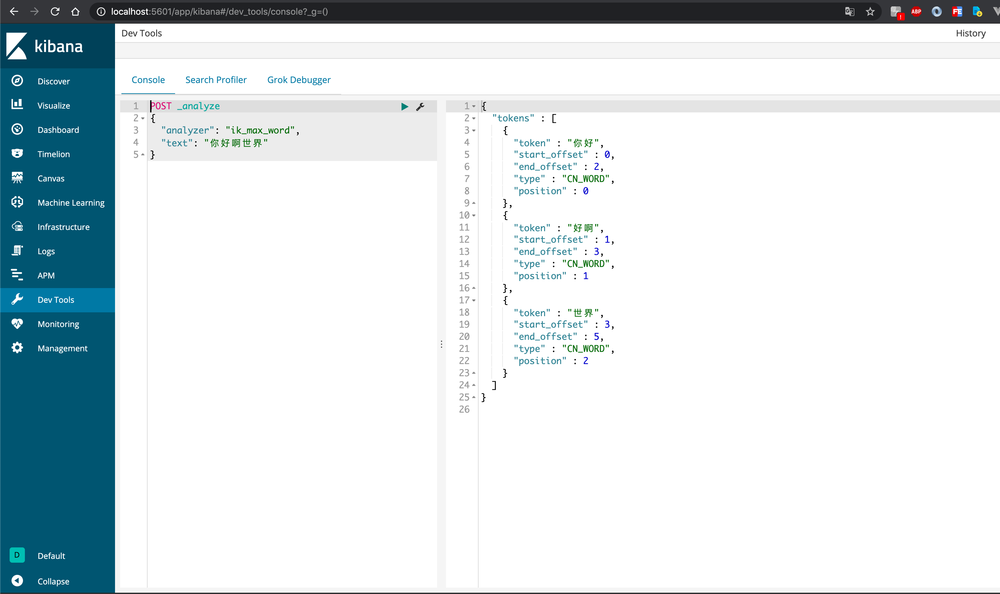
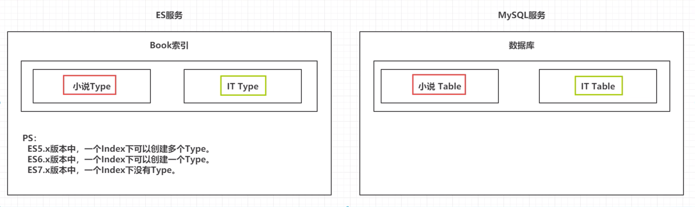
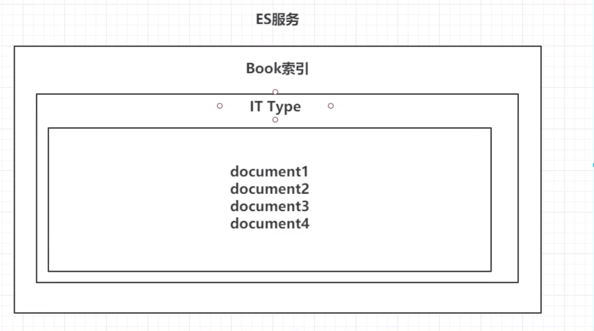
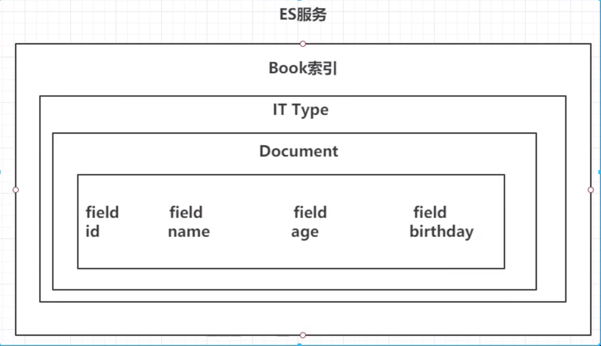
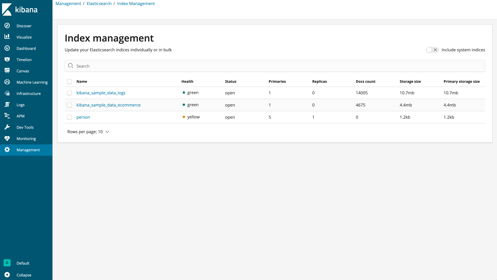
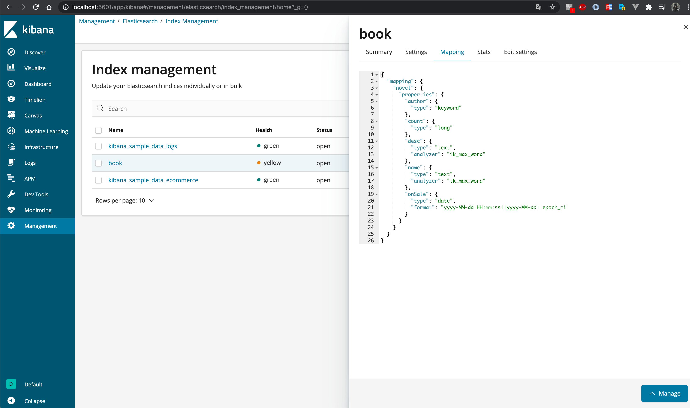

# ES笔记
## 一.安装

### 1.1 elasticsearch和kibana

+ docker-compose.yml
  ```yaml
  version: "3.1"
  services:
    elasticsearch:
      #image: docker.elastic.co/elasticsearch/elasticsearch-oss:6.5.4
      image: daocloud.io/library/elasticsearch:6.5.4
      container_name: elasticsearch
      restart: always
      ports:
        - "9200:9200"
    kibana:
      container_name: kibana
      #image: docker.elastic.co/kibana/kibana:6.5.4
      image: daocloud.io/library/kibana:6.5.4
      ports:
        - "5601:5601"
      restart: always
      environment:
        - ELASTICSEARCH_HOSTS=http://localhost:9200
      depends_on:
        - elasticsearch
  ```

+ 当前目录下运行

  ```shell
  docker-compose up -d 
  docker-compose logs -f #查看日志
  ```


+ 查看elasticsearch 运行状态

  

### 1.2 ik分词器

+ github地址	

  ``` 
  https://github.com/medcl/elasticsearch-analysis-ik
  ```

  找到对应版本并复制下载链接

+ 安装

  进入elasticsearch容器中并安装ik分词器

  ```shell
  docker ps -a #查看所有容器
  docker exec -it 662 bash  #进入es容器
  elasticsearch-plugin install https://github.com/medcl/elasticsearch-analysis-ik/releases/download/v6.5.4/elasticsearch-analysis-ik-6.5.4.zip  #容器中安装ik分词器
  docker restart 662 #重启容器
  ```

+ 验证

  


## 二. ElasticSearch基本操作

### 2.1 ES的结构

#### 2.1.1 索引Index，分片和备份

> ES服务中，可以创建多个索引。
>
> 每一个索引默认被分成5个分片。
>
> 每一个分片都会存在至少一个备份分片。
>
> 备份分片默认不会帮助检索数据，当ES检索压力特别大的时候，备份分片才会帮助检索数据。
>
> 备份分片必须放在不同的服务器中。


#### 2.1.2 类型Type

>一个索引下可以创建多个类型
>
>PS：根据版本不同，类型的创建也不同



#### 2.1.3 文档Doc

>一个类型下可以有多个文档。 这个文档就相当于MySql表中的多行数据。





#### 2.1.4 属性Field

> 一个文档中可以包含多个属性。类似于MySql表中的一行数据存在多个列。



### 2.2 Restful语法

>  GET请求:
>    http://ip:port/index     查询es的index
>    http://ip:port/index/type/doc_id    根据文档id查询指定文档的信息
>  POST请求:
>    http://ip:port/index/type/_search   查询文档，可以在请求体中添加json字符串的内容，代表查询条件
>    http://ip:port/index/type/doc_id/_update  修改文档 ，在请求体中指定json字符串，代表修改条件
>  PUT请求:
>    http://ip:port/index   创建索引,请求体中指定索引的信息
>    http://ip:port/index/type_mappings  创建索引，然后指定索引存储文档的属性
>  DELETE请求:
>    http://ip:port/index   删除索引 
>    http://ip:port/index/type/doc_id  删除指定的文档

### 2.3 索引的操作

#### 2.3.1 创建索引

```json
#创建一个索引
PUT /person
{
  "settings": {
    "number_of_shards": 5, 
    "number_of_replicas": 1
  }
}
```

#### 2.3.2 查询索引



``` json
#查询索引信息
GET /person
```

#### 2.3.3 删除索引


```json
#删除索引
DELETE /person
```

### 2.4 Field数据类型

[官网地址](https://www.elastic.co/guide/en/elasticsearch/reference/6.5/mapping-types.html)

> ## Field datatypes
>
> Elasticsearch supports a number of different datatypes for the fields in a document:
>
> ### Core datatypes
>
> - **string**
>
>   [`text`](https://www.elastic.co/guide/en/elasticsearch/reference/6.5/text.html) and [`keyword`](https://www.elastic.co/guide/en/elasticsearch/reference/6.5/keyword.html)
>
> - **[Numeric datatypes](https://www.elastic.co/guide/en/elasticsearch/reference/6.5/number.html)**
>
>   `long`, `integer`, `short`, `byte`, `double`, `float`, `half_float`, `scaled_float`
>
> - **[Date datatype](https://www.elastic.co/guide/en/elasticsearch/reference/6.5/date.html)**
>
>   `date`
>
> - **[Boolean datatype](https://www.elastic.co/guide/en/elasticsearch/reference/6.5/boolean.html)**
>
>   `boolean`
>
> - **[Binary datatype](https://www.elastic.co/guide/en/elasticsearch/reference/6.5/binary.html)**
>
>   `binary`
>
> - **[Range datatypes](https://www.elastic.co/guide/en/elasticsearch/reference/6.5/range.html)**
>
>   `integer_range`, `float_range`, `long_range`, `double_range`, `date_range`
>
> ### Complex datatypes
>
> - **[Object datatype](https://www.elastic.co/guide/en/elasticsearch/reference/6.5/object.html)**
>
>   `object` for single JSON objects
>
> - **[Nested datatype](https://www.elastic.co/guide/en/elasticsearch/reference/6.5/nested.html)**
>
>   `nested` for arrays of JSON objects
>
> ### Geo datatypes
>
> - **[Geo-point datatype](https://www.elastic.co/guide/en/elasticsearch/reference/6.5/geo-point.html)**
>
>   `geo_point` for lat/lon points
>
> - **[Geo-Shape datatype](https://www.elastic.co/guide/en/elasticsearch/reference/6.5/geo-shape.html)**
>
>   `geo_shape` for complex shapes like polygons
>
> ### Specialised datatypes
>
> - **[IP datatype](https://www.elastic.co/guide/en/elasticsearch/reference/6.5/ip.html)**
>
>   `ip` for IPv4 and IPv6 addresses
>
> - **[Completion datatype](https://www.elastic.co/guide/en/elasticsearch/reference/6.5/search-suggesters-completion.html)**
>
>   `completion` to provide auto-complete suggestions
>
> - **[Token count datatype](https://www.elastic.co/guide/en/elasticsearch/reference/6.5/token-count.html)**
>
>   `token_count` to count the number of tokens in a string
>
> - **[`mapper-murmur3`](https://www.elastic.co/guide/en/elasticsearch/plugins/6.5/mapper-murmur3.html)**
>
>   `murmur3` to compute hashes of values at index-time and store them in the index
>
> - **[`mapper-annotated-text`](https://www.elastic.co/guide/en/elasticsearch/plugins/6.5/mapper-annotated-text.html)**
>
>   `annotated-text` to index text containing special markup (typically used for identifying named entities)
>
> - **[Percolator type](https://www.elastic.co/guide/en/elasticsearch/reference/6.5/percolator.html)**
>
>   Accepts queries from the query-dsl
>
> - **[`join` datatype](https://www.elastic.co/guide/en/elasticsearch/reference/6.5/parent-join.html)**
>
>   Defines parent/child relation for documents within the same index
>
> - **[Alias datatype](https://www.elastic.co/guide/en/elasticsearch/reference/6.5/alias.html)**
>
>   Defines an alias to an existing field.
>
> ### Arrays
>
> In Elasticsearch, arrays do not require a dedicated field datatype. Any field can contain zero or more values by default, however, all values in the array must be of the same datatype. See [Arrays](https://www.elastic.co/guide/en/elasticsearch/reference/6.5/array.html).
>
> ### Multi-fields
>
> It is often useful to index the same field in different ways for different purposes. For instance, a `string` field could be mapped as a `text` field for full-text search, and as a `keyword` field for sorting or aggregations. Alternatively, you could index a text field with the [`standard` analyzer](https://www.elastic.co/guide/en/elasticsearch/reference/6.5/analysis-standard-analyzer.html), the [`english`](https://www.elastic.co/guide/en/elasticsearch/reference/6.5/analysis-lang-analyzer.html#english-analyzer) analyzer, and the [`french` analyzer](https://www.elastic.co/guide/en/elasticsearch/reference/6.5/analysis-lang-analyzer.html#french-analyzer).
>
> This is the purpose of *multi-fields*. Most datatypes support multi-fields via the [`fields`](https://www.elastic.co/guide/en/elasticsearch/reference/6.5/multi-fields.html) parameter.


> ## 1 字符串类型
>     text           # 最常用，一般用于全文检索，会给fleld分词
>     keyword        # 关键字，不会给fleld进行分词
> ## 2 数值类型
>     long
>     integer
>     short
>     byte
>     double
>     float
>     half_float      # 精度比float小一半，float是32位，这个是16位
>     scaled_float    # 根据long类型的结果和你指定的secled来表达浮点类型：long:123 ,secled:100，结果：1.23
> ## 3 时间类型
>     date         # 可以指定具体的格式  "format": "yyyy-MM-dd HH:mm:ss||yyyy-MM-dd||epoch_millis"
> ## 4 布尔类型
>     boolean   
> ## 5 二进制类型
>     binary       # 基于base64的二进制
> ## 6 范围类型
>     integer_range
>     double_range
>     long_range
>     float_range
>     data_range
>     ip_range
> ## 7 经纬度类型
>     geo_point   # 存储经纬度
> ## 8 ip类型
>     ip    # v4 v6都可以


### 2.5 创建索引并制定数据结构

```json
#创建索引并指定数据结构
PUT /book
{
  "settings": {
    # 备份数
    "number_of_replicas": 1,
    # 分片数
    "number_of_shards": 5
  },
  # 指定数据结构
  "mappings": {
  	# 类型 Type
    "novel": {
  		# 文档存储的Field
      "properties": {
  			# Field属性名
        "name": {
  				# 类型
          "type": "text",
  				# 指定分词器
          "analyzer": "ik_max_word",
          # 指定当前Field可以被作为查询条件 默认值true
  				"index": true,
  				# 是否需要额外存储 默认值false
          "store": false
        },
        "author": {
          "type": "keyword"
        },
        "count": {
          "type": "long"
        },
        "onSale": {
          "type": "date",
          # 时间类型的格式化方式
          "format": "yyyy-MM-dd HH:mm:ss||yyyy-MM-dd||epoch_millis"
        },
        "desc": {
          "type": "text",
          "analyzer": "ik_max_word"
        }
      }
    }
  }
}
```





### 2.6文档的操作

> 文档在ES服务中的唯一标识，`_index`，`_type`，`_id`三个内容为组合，锁定一个文档，操作时添加还是修改


#### 2.6.1 新建文档

`自动生成id`

```json
# 添加文档，自动生成id
POST /book/novel
{
  "name": "三体",
  "author": "刘慈欣",
  "count": "200000",
  "onSale": "2006-05-01",
  "desc": "三体一二三"
}
```


`手动指定id`

```json
# 添加文档，手动指定id
POST /book/novel/1
{
  "name": "西游记",
  "author": "吴承恩",
  "count": "5555555",
  "onSale": "1888-01-01",
  "desc": "猴哥猴哥你真了不得"
}
```


#### 2.6.2 修改文档

`覆盖修改`

```json
# 同手动指定id，覆盖修改
POST /book/novel/1
{
  "name": "西游记后传",
  "author": "曹琴",
  "count": "6666",
  "onSale": "2000-01-01",
  "desc": "我还没用力你就倒下了"
}

```


`field修改`

```json
# 根据id，修改文档
POST /book/novel/4LhSPHcB0hAhs5j4fjR4/_update
{
  "doc": {
    "count": "8888888"
  }
}
```

​	

#### 2.6.3 删除文档

`根据id删除`

```json
# 根据id，删除文档
DELETE /book/novel/4LhSPHcB0hAhs5j4fjR4
```

## 三.  Java操作ElasticSearch

### 3.1 依赖/连接

`pom文件`

```xml
        <dependency>
            <groupId>org.elasticsearch</groupId>
            <artifactId>elasticsearch</artifactId>
            <version>6.5.4</version>
        </dependency>

        <dependency>
            <groupId>org.elasticsearch.client</groupId>
            <artifactId>elasticsearch-rest-high-level-client</artifactId>
            <version>6.5.4</version>
        </dependency>
```


```java
public class ESClient {

    public static RestHighLevelClient getClient() {

        HttpHost httpHost = new HttpHost("localhost", 9200);

        RestClientBuilder restClientBuilder = RestClient.builder(httpHost);

        RestHighLevelClient restHighLevelClient = new RestHighLevelClient(restClientBuilder);

        return restHighLevelClient;
    }
}
```


### 3.2 Java操作索引

#### 3.2.1 创建索引

```java
public class Demo2 {

    String index = "person";

    String type = "man";

    RestHighLevelClient client = ESClient.getClient();

    @Test
    public void createIndex() throws IOException {
        // 1.索引 settings 配置
        Settings.Builder settings = Settings.builder()
                .put("number_of_shards", 3)
                .put("number_of_replicas", 1);

        // 2.索引 mappings 配置
        XContentBuilder mappings = JsonXContent.contentBuilder()
                .startObject()
                    .startObject("properties")
                        .startObject("name")
                            .field("type", "text")
                        .endObject()
                        .startObject("age")
                            .field("type", "integer")
                        .endObject()
                        .startObject("birthday")
                            .field("type", "date")
                            .field("format", "yyyy-MM-dd")
                        .endObject()
                    .endObject()
                .endObject();

        // 3. 将 settings和mapping封装到CreateIndexRequest对象中
        CreateIndexRequest request = new CreateIndexRequest(index)
                .settings(settings)
                .mapping(type, mappings);

        // 4. 通过client对象去连接ES并执行创建索引
        CreateIndexResponse response = client.indices().create(request, RequestOptions.DEFAULT);

        System.out.println("response:" + response);

    }
}
```

#### 3.2.2 检查索引是否存在

```java
@Test
public void exitsIndex() throws IOException {
  GetIndexRequest request = new GetIndexRequest();
  request.indices(index);

  boolean exits = client.indices().exists(request, RequestOptions.DEFAULT);

  System.out.println(exits);
}

```

#### 3.2.3删除索引

```java
@Test
public void deleteIndex() throws IOException {
  DeleteIndexRequest request = new DeleteIndexRequest();
  request.indices(index);

  AcknowledgedResponse response = client.indices().delete(request, RequestOptions.DEFAULT);

  System.out.println(response.isAcknowledged());
}
```

### 3.3 Java操作文档

#### 3.3.1 添加文档

```java
public class Demo3 {

    RestHighLevelClient client = ESClient.getClient();
    ObjectMapper mapper = new ObjectMapper();

    String index = "person";
    String type = "man";

    @Test
    public void createDoc() throws IOException {

        // 1. 准备json数据
        Person person = new Person(1, "阿宾", 35, new Date());
        String json = mapper.writeValueAsString(person);

        // 2. 准备request对象（手动指定id）
        IndexRequest request = new IndexRequest(index, type, person.getId().toString());
        request.source(json, XContentType.JSON);

        // 3. 通过client对象执行添加
        IndexResponse response = client.index(request, RequestOptions.DEFAULT);

        System.out.println(response.getResult());

    }
}
```


#### 3.3.2 修改文档

```java
@Test
public void updateDoc() throws IOException {
  // 1. 准备修改map
  Map<String, Object> doc = new HashMap<String, Object>();
  doc.put("name", "abin");
  String docId = "1";

  // 2. 准备request对象（手动指定id）
  UpdateRequest request = new UpdateRequest(index, type, docId);
  request.doc(doc);

  // 3. 通过client对象执行修改
  UpdateResponse response = client.update(request, RequestOptions.DEFAULT);

  System.out.println(response.getResult().toString());
}
```


#### 3.3.3 删除文档

```java
@Test
public void deleteDoc() throws IOException {
  // 1. 准备request对象（手动指定id）
  DeleteRequest request = new DeleteRequest(index, type, "1");

  // 2. 通过client对象执行删除
  DeleteResponse response = client.delete(request, RequestOptions.DEFAULT);

  System.out.println(response.getResult().toString());

}
```


### 3.4 批量操作文档

#### 3.4.1 批量添加

```java
@Test
public void bulkDoc() throws IOException {
  // 1. 准备json数据
  Person p1 = new Person(1, "张三", 11, new Date());
  Person p2 = new Person(2, "李四", 12, new Date());
  Person p3 = new Person(3, "王五", 13, new Date());

  String json1 = mapper.writeValueAsString(p1);
  String json2 = mapper.writeValueAsString(p2);
  String json3 = mapper.writeValueAsString(p3);

  // 2. 准备request对象
  BulkRequest request = new BulkRequest();
  request.add(new IndexRequest(index, type, p1.getId().toString()).source(json1, XContentType.JSON));
  request.add(new IndexRequest(index, type, p2.getId().toString()).source(json2, XContentType.JSON));
  request.add(new IndexRequest(index, type, p3.getId().toString()).source(json3, XContentType.JSON));

  // 3. client执行
  BulkResponse response = client.bulk(request, RequestOptions.DEFAULT);

  System.out.println("hasFailures:" + response.hasFailures());

}
```


#### 3.4.2 批量删除

```java
@Test
public void bulkDeleteDoc() throws IOException {

  BulkRequest request = new BulkRequest();

  request.add(new DeleteRequest(index, type, "1"));
  request.add(new DeleteRequest(index, type, "2"));
  request.add(new DeleteRequest(index, type, "3"));

  BulkResponse responses = client.bulk(request, RequestOptions.DEFAULT);

  System.out.println("hasFailures:" + responses.hasFailures());

}
```


## 四. ElasticSearch 练习

`SmsLogs.java`

```java
@Data
@NoArgsConstructor
@AllArgsConstructor
public class SmsLogs {
    @JsonIgnore
    private String id; // id

    @JsonFormat(pattern = "yyyy-MM-dd")
    private Date createDate; // 创建时间

    @JsonFormat(pattern = "yyyy-MM-dd")
    private Date sendDate; // 发送时间

    private String longCode; // 发送的长号码

    private String mobile; // 手机号

    private String corpName;  // 发送公司名称

    private String smsContent; // 短信内容

    private Integer start; // 短信发送状态,0成功，1失败

    private Integer operatorId; // 运营商编号 1移动 2联通 3电信

    private String province; // 省份

    private String ipAddr; // 服务器ip地址

    private Integer replyTotal; // 短信状态报告返回时长（秒）

    private Integer fee; // 费用

}
```


`Training.java`

```java
public class Training {

    String index = "sms-logs-index";
    String type = "sms-logs-type";

    ObjectMapper mapper = new ObjectMapper();

    RestHighLevelClient client = ESClient.getClient();

    @Test
    public void createIndex() throws IOException {
        Settings.Builder settings = Settings.builder()
                .put("number_of_shards", "3")
                .put("number_of_replicas", "1");

        XContentBuilder mappings = JsonXContent.contentBuilder()
                .startObject()
                .startObject("properties")
                .startObject("createDate")
                .field("type", "date")
                .field("format", "yyyy-MM-dd")
                .endObject()
                .startObject("sendDate")
                .field("type", "date")
                .field("format", "yyyy-MM-dd")
                .endObject()
                .startObject("longCode")
                .field("type", "keyword")
                .endObject()
                .startObject("mobile")
                .field("type", "keyword")
                .endObject()
                .startObject("corpName")
                .field("type", "keyword")
                .endObject()
                .startObject("smsContent")
                .field("type", "text")
                .field("analyzer", "ik_max_word")
                .endObject()
                .startObject("state")
                .field("type", "integer")
                .endObject()
                .startObject("operatorId")
                .field("type", "integer")
                .endObject()
                .startObject("province")
                .field("type", "keyword")
                .endObject()
                .startObject("ipAddr")
                .field("type", "ip")
                .endObject()
                .startObject("replyTotal")
                .field("type", "integer")
                .endObject()
                .startObject("fee")
                .field("type", "long")
                .endObject()
                .endObject()
                .endObject();

        CreateIndexRequest request = new CreateIndexRequest(index)
                .settings(settings)
                .mapping(type, mappings);

        CreateIndexResponse response = client.indices().create(request, RequestOptions.DEFAULT);

        System.out.println(response.isAcknowledged());

    }

    @Test
    public void bulkDoc() throws IOException {
        // 准备多个json数据
        SmsLogs s1 = new SmsLogs("1",new Date(),new Date(),"10690000988","1370000001","途虎养车","【途虎养车】亲爱的刘女士，您在途虎购买的货物单号(Th12345678)",0,1,"上海","10.126.2.9",10,3);
        SmsLogs s2 = new SmsLogs("2",new Date(),new Date(),"84690110988","1570880001","韵达快递","【韵达快递】您的订单已配送不要走开哦,很快就会到了,配送员:王五，电话:15300000001",0,1,"上海","10.126.2.8",13,5);
        SmsLogs s3 = new SmsLogs("3",new Date(),new Date(),"10698880988","1593570001","滴滴打车","【滴滴打车】指定的车辆现在距离您1000米,马上就要到了,请耐心等待哦,司机:李师傅，电话:13890024793",0,1,"河南","10.126.2.7",12,10);
        SmsLogs s4 = new SmsLogs("4",new Date(),new Date(),"20697000911","1586890005","中国移动","【中国移动】尊敬的客户，您充值的话费100元，现已经成功到账，您的当前余额为125元,2020年12月18日14:35",0,1,"北京","10.126.2.6",11,4);
        SmsLogs s5 = new SmsLogs("5",new Date(),new Date(),"18838880279","1562384869","网易","【网易】亲爱的玩家,您已经排队成功,请尽快登录到网易云游戏进行游玩,祝您游戏愉快---网易云游戏",0,1,"杭州","10.126.2.5",10,2);
        // 转为json
        ObjectMapper mapper = new ObjectMapper();
        String json1 = mapper.writeValueAsString(s1);
        String json2 = mapper.writeValueAsString(s2);
        String json3 = mapper.writeValueAsString(s3);
        String json4 = mapper.writeValueAsString(s4);
        String json5 = mapper.writeValueAsString(s5);

        BulkRequest request = new BulkRequest();
        request.add(new IndexRequest(index, type, s1.getId()).source(json1, XContentType.JSON));
        request.add(new IndexRequest(index, type, s2.getId()).source(json2, XContentType.JSON));
        request.add(new IndexRequest(index, type, s3.getId()).source(json3, XContentType.JSON));
        request.add(new IndexRequest(index, type, s4.getId()).source(json4, XContentType.JSON));
        request.add(new IndexRequest(index, type, s5.getId()).source(json5, XContentType.JSON));

        BulkResponse response = client.bulk(request, RequestOptions.DEFAULT);

        System.out.println(response.hasFailures());

    }
}
```


## 五. ElasticSearch 各种查询

### 5.1 term&terms查询

#### 5.1.1 term查询

> term查询是代表的完全匹配，搜索之前不会对搜索的关键字进行分词，会对关键字去文档分词库去匹配内容。

```json
POST /sms-logs-index/sms-logs-type/_search
{
  "from": 0, 
  "size": 5,
  "query": {
    "term": {
      "province": {
        "value": "上海"
      }
    }
  }
}
```


```java
@Test
public void termQuery() throws IOException {

      // 1. 创建request对象
      SearchRequest request = new SearchRequest(index);
      request.types(type);

      // 2. 指定条件查询
      SearchSourceBuilder builder = new SearchSourceBuilder();
      builder.from(0);
      builder.size(5);
      builder.query(QueryBuilders.termQuery("province", "上海"));

      request.source(builder);

      // 3. 执行查询
      SearchResponse response = client.search(request, RequestOptions.DEFAULT);

      // 4. 读取到source中的数据，并展示
      for (SearchHit hit : response.getHits().getHits()) {
        Map<String, Object> result = hit.getSourceAsMap();
        System.out.println(result);
      }
    }
```

#### 5.1.2 terms查询

> terms和term的查询机制一样，都不会将指定关键字进行分词，会直接去分词库中匹配，找到相应文档内容。
>
> terms是针对一个字段包含多个值使用
>
> term： where province = 北京
>
> terms：where province in ['北京','上海','深圳']

```json
POST /sms-logs-index/sms-logs-type/_search
{
  "query": {
    "terms": {
      "province": [
        "北京",
        "上海"
      ]
    }
  }
}
```

```java
@Test
public void termsQuery() throws IOException {

    SearchRequest request = new SearchRequest(index);
    request.types(type);

    SearchSourceBuilder builder = new SearchSourceBuilder();
    builder.query(QueryBuilders.termsQuery("province", "北京", "上海"));

    request.source(builder);

    SearchResponse response = client.search(request, RequestOptions.DEFAULT);

    for (SearchHit hit : response.getHits().getHits()) {
      Map<String, Object> result = hit.getSourceAsMap();
      System.out.println(result);
    }

}
```


### 5.2 match查询

>match查询属于高层查询，他会根据你查询字段不一样，采用不同的查询方式
>
>+ 查询的是日期或者是数值的情况下，会将字符串内容转为日期或是数值
>+ 如果查询的内容是一个不能分词的内容（keyword），match查询不会对查询的关键字进行分词
>+ 若果查询的内容是一个可以被分词的内容（text），match查询会根据分词器进行分词，去分词库中匹配响应内容。
>
>match查询底层实际是多个term查询，将多个term查询结果封装到了一起

#### 5.2.1 match_all查询

>查询全部内容，不指定查询条件

```json
POST /sms-logs-index/sms-logs-type/_search
{
  "query": {
    "match_all": {}
  }
}
```

```java
@Test
public void matchAllQuery() throws IOException {

    SearchRequest request = new SearchRequest(index);
    request.types(type);

    SearchSourceBuilder builder = new SearchSourceBuilder();
    builder.from(2);
    // ES 默认只查询10条数据，如果想指定条数，添加size
    builder.size(2);
    builder.query(QueryBuilders.matchAllQuery());

    request.source(builder);

    SearchResponse response = client.search(request, RequestOptions.DEFAULT);

    for (SearchHit hit : response.getHits().getHits()) {
      Map<String, Object> result = hit.getSourceAsMap();
      System.out.println(result);
    }

}
```

#### 5.2.2 match查询

> 指定一个Field作为筛选条件

```json
POST /sms-logs-index/sms-logs-type/_search
{
  "query": {
    "match": {
      "smsContent": "移动充值"
    }
  }
}
```

```java
@Test
public void matchQuery() throws IOException {

    SearchRequest request = new SearchRequest(index);
    request.types(type);

    SearchSourceBuilder builder = new SearchSourceBuilder();
    builder.query(QueryBuilders.matchQuery("smsContent", "移动充值"));
    request.source(builder);

    SearchResponse response = client.search(request, RequestOptions.DEFAULT);

    for (SearchHit hit : response.getHits().getHits()) {
      Map<String, Object> result = hit.getSourceAsMap();
      System.out.println(result);
    }

}
```

#### 5.2.3 布尔match查询

>基于一个Field匹配内容，采用and或or的方式连接

```json
POST  /sms-logs-index/sms-logs-type/_search
{
  "query": {
    "match": {
      "smsContent": {
        "query": "移动 网易",
        "operator": "or"
      }
    }
 }
  
```

---

```json
POST  /sms-logs-index/sms-logs-type/_search
{
  "query": {
    "match": {
      "smsContent": {
        "query": "登录 游戏",
        "operator": "and"
      }
    }
  }
} 
```

```java
@Test
public void boolMatchQuery() throws IOException {

    SearchRequest request = new SearchRequest(index);
    request.types(type);

    SearchSourceBuilder builder = new SearchSourceBuilder();
    builder.query(QueryBuilders.matchQuery("smsContent", "登录 游戏").operator(Operator.OR));
    request.source(builder);

    SearchResponse response = client.search(request, RequestOptions.DEFAULT);

    for (SearchHit hit : response.getHits().getHits()) {
      Map<String, Object> result = hit.getSourceAsMap();
      System.out.println(result);
    }

}
```

#### 5.2.4 multi_match查询

>match针对一个field做检索，multi_match针对多个field进行检索。多个key对应一个text。


```json
POST /sms-logs-index/sms-logs-type/_search
{
  "query": {
    "multi_match": {
      "query": "网易",
      "fields": ["smsContent", "corpName"]
    }
  }
}
```

---

```java
@Test
public void multiMatchQuery() throws IOException {
    SearchRequest request = new SearchRequest(index);
    request.types(type);

    SearchSourceBuilder builder = new SearchSourceBuilder();
    builder.query(QueryBuilders.multiMatchQuery("北京", "province", "smsContent"));
    request.source(builder);

    SearchResponse response = client.search(request, RequestOptions.DEFAULT);

    for (SearchHit hit : response.getHits().getHits()) {
      Map<String, Object> result = hit.getSourceAsMap();
      System.out.println(result);
    }
}
```


### 5.3 其他查询

#### 5.3.1 id查询

```
GET /sms-logs-index/sms-logs-type/1
```

---

```java
@Test
public void findById() throws IOException {
    GetRequest request = new GetRequest(index, type, "1");

    GetResponse response = client.get(request, RequestOptions.DEFAULT);

    System.out.println(response.getSourceAsString());
}
```


#### 5.3.2 ids查询

>根据多个id查询，类似MySQL中的in

```json
POST /sms-logs-index/sms-logs-type/_search
{
  "query": {
    "ids": {
      "values": ["1", "2", "3"]
    }
  }
}
```

---

```java
@Test
public void findByIds() throws IOException {
    SearchRequest request = new SearchRequest(index);
    request.types(type);

    SearchSourceBuilder builder = new SearchSourceBuilder();
    builder.query(QueryBuilders.idsQuery().addIds("1", "2", "3"));
    request.source(builder);

    SearchResponse response = client.search(request, RequestOptions.DEFAULT);

    for (SearchHit hit : response.getHits().getHits()) {
      System.out.println(hit.getSourceAsString());
    }
}
```


#### 5.3.3 prefix查询

>前缀查询，可以通过一个关键字去指定一个Field的前缀，从而查询指定的文档

```json
POST /sms-logs-index/sms-logs-type/_search
{
  "query": {
    "prefix": {
      "corpName": {
        "value": "途虎"
      }
    }
  }
}
```

---

```java
@Test
public void prefixQuery() throws IOException {
    SearchRequest request = new SearchRequest(index);
    request.types(type);

    SearchSourceBuilder builder = new SearchSourceBuilder();
    builder.query(QueryBuilders.prefixQuery("corpName", "途虎"));
    request.source(builder);

    SearchResponse response = client.search(request, RequestOptions.DEFAULT);

    for (SearchHit hit : response.getHits().getHits()) {
      System.out.println(hit.getSourceAsString());
    }
}
```


#### 5.3.4 fuzzy查询

>模糊查询，输入字符的大概，ES就根据输入的内容大概去匹配结果。

```json
POST /sms-logs-index/sms-logs-type/_search
{
  "query": {
    "fuzzy": {
      "corpName": {
        "value": "韵达快送",
        "prefix_length": 2 #指定前面几个字符是不允许出现错误的
      }
    }
  }
}
```

---

```java
@Test
public void fuzzyQuery() throws  IOException {
    SearchRequest request = new SearchRequest(index);
    request.types(type);

    SearchSourceBuilder builder = new SearchSourceBuilder();
    builder.query(QueryBuilders.fuzzyQuery("corpName", "韵达快送").prefixLength(2));
    request.source(builder);

    SearchResponse response = client.search(request, RequestOptions.DEFAULT);

    for (SearchHit hit : response.getHits().getHits()) {
      System.out.println(hit.getSourceAsString());
    }
}
```

#### 5.3.5 wildcard查询

>统配查询，类似MySQL中的like查询，在字符串中指定通配符*和占位符？

```json
POST /sms-logs-index/sms-logs-type/_search
{
  "query": {
    "wildcard": {
      "corpName": {
        "value": "中国*"
      }
    }
  }
}
```

---

```java
@Test
public void wildcardQuery() throws IOException {
    SearchRequest request = new SearchRequest(index);
    request.types(type);

    SearchSourceBuilder builder = new SearchSourceBuilder();
    builder.query(QueryBuilders.wildcardQuery("corpName", "中国*"));
    request.source(builder);

    SearchResponse response = client.search(request, RequestOptions.DEFAULT);

    for (SearchHit hit : response.getHits().getHits()) {
      System.out.println(hit.getSourceAsString());
    }
}
```


#### 5.3.6 range查询

>范围查询，只针对数值类型，对某一个Field进行大于或者小于的范围指定

```json
POST /sms-logs-index/sms-logs-type/_search
{
  "query": {
    "range": {
      "fee": {
        # 可以使用 gt: >,	lt: <, gte >=, lte: <=
        "gte": 10,
        "lte": 20
      }
    }
  }
}
```

---

```java
@Test
public void rangeQuery() throws IOException{
    SearchRequest request = new SearchRequest(index);
    request.types(type);

    SearchSourceBuilder builder = new SearchSourceBuilder();
    builder.query(QueryBuilders.rangeQuery("fee").gte(10).lte(20));
    request.source(builder);

    SearchResponse response = client.search(request, RequestOptions.DEFAULT);

    for (SearchHit hit : response.getHits().getHits()) {
      System.out.println(hit.getSourceAsString());
    }
}
```

#### 5.3.7 regexp查询

>正则查询，通过编写的正则表达式去匹配内容
>
>PS: 
>
> **prefix,fuzzy,wildcard和regexp查询效率相对较低，要求效率比较高时，避免去使用**

```json
POST /sms-logs-index/sms-logs-type/_search
{
  "query": {
    "regexp": {
      "mobile": "137[0-9]{8}"
    }
  }
}
```

---

```java
@Test
public void regexpQuery() throws IOException {
    SearchRequest request = new SearchRequest(index);
    request.types(type);

    SearchSourceBuilder builder = new SearchSourceBuilder();
    builder.query(QueryBuilders.regexpQuery("mobile", "137[0-9]{8}"));
    request.source(builder);

    SearchResponse response = client.search(request, RequestOptions.DEFAULT);

    for (SearchHit hit : response.getHits().getHits()) {
      System.out.println(hit.getSourceAsString());
    }
}
```


### 5.4 深分页

>ES对from+size是有限制的，from和size二者之和不能超过1W
>
>原理：
>
>from+size在ES查询数据的方式：
>
>+ 第一步将用户指定的关键字进行分词
>+ 第二步将汇去分词库中进行检索，得到多个文档id
>+ 第三步去各个分片中去拉取指定的数据。耗时较长
>+ 第四步将根据score进行排序。耗时较长
>+ 第五步根据from的值，将查询到的数据舍弃一部分
>+ 第六步返回结果
>
>Scroll在ES查询数据的方式：
>
>+ 第一步将用户指定的关键字进行分词
>+ 第二步将汇去分词库中进行检索，得到多个文档id
>+ 第三步将文档的id存放在一个ES的上下文中
>+ 第四步根据你指定的size个数去ES中检索指定个数的数据，拿完数据的文档id，会从上下文中移除
>+ 第五步如果需要下一页数据，直接从ES的上下文中找后续内容
>+ 第六步循环第四步和第五步
>
>**Scroll查询方式，不适合做实时的查询**


```json
#执行scroll查询，返回第一页数据，并且将文档id信息存放在ES上下文中，指定生存时间1m
POST /sms-logs-index/sms-logs-type/_search?scroll=1m
{
  "query": {
    "match_all": {}
  },
  "size": 2,
  "sort": [
    {
      "fee": {
        "order": "desc"
      }
    }
  ]
}

#根据scroll查询下一页数据
POST /_search/scroll
{
  "scroll_id":"DnF1ZXJ5VGhlbkZldGNoAwAAAAAAADGFFmNJeW8zUlByU2kyZ21VdkRWR29sUGcAAAAAAAAxhBZjSXlvM1JQclNpMmdtVXZEVkdvbFBnAAAAAAAAMYYWY0l5bzNSUHJTaTJnbVV2RFZHb2xQZw==",
  "scroll": "1m"
}

#删除scroll在ES上下文中的数据
DELETE /_search/scroll/DnF1ZXJ5VGhlbkZldGNoAwAAAAAAADGFFmNJeW8zUlByU2kyZ21VdkRWR29sUGcAAAAAAAAxhBZjSXlvM1JQclNpMmdtVXZEVkdvbFBnAAAAAAAAMYYWY0l5bzNSUHJTaTJnbVV2RFZHb2xQZw==
```

---

```java
@Test
public void scrollQuery() throws IOException {
    // 1.创建SearchRequest
    SearchRequest request = new SearchRequest(index);
    request.types(type);

    // 2.指定scroll信息
    request.scroll(TimeValue.timeValueMinutes(1L));

    // 3.指定查询条件
    SearchSourceBuilder builder = new SearchSourceBuilder();
    builder.query(QueryBuilders.matchAllQuery()).size(2).sort("fee", SortOrder.DESC);
    request.source(builder);

    // 4.获取返回结果scrollId，source
    SearchResponse response = client.search(request, RequestOptions.DEFAULT);

    String scrollId = response.getScrollId();
    System.out.println("-----------首页-----------");
    for (SearchHit hit : response.getHits().getHits()) {
      System.out.println(hit.getSourceAsMap());
    }

    while (true) {

      // 5.循环-创建SearchScrollRequest
      SearchScrollRequest scrollRequest = new SearchScrollRequest(scrollId);

      // 6.指定scrollId的生存时间
      scrollRequest.scroll(TimeValue.timeValueSeconds(1L));

      // 7.执行查询获取返回结果
      SearchResponse scrollResp = client.scroll(scrollRequest, RequestOptions.DEFAULT);

      // 8.判断是否查询到了数据，输出
      SearchHit[] hits = scrollResp.getHits().getHits();
      if (hits != null && hits.length > 0) {
        System.out.println("----------下一页-----------");
        for (SearchHit hit : hits) {
          System.out.println(hit.getSourceAsMap());
        }
      } else {
        // 9.判断没有查询到数据-退出循环
        System.out.println("-----------结束------------");

        break;
      }
    }

    // 10.创建ClearScrollRequest
    ClearScrollRequest clearScrollRequest = new ClearScrollRequest();

    // 11.指定scrollId
    clearScrollRequest.addScrollId(scrollId);

    // 12.删除ScrollId
    ClearScrollResponse clearScrollResponse = client.clearScroll(clearScrollRequest, RequestOptions.DEFAULT);

    // 13.输出结果
    System.out.println("删除scroll：" + clearScrollResponse.isSucceeded());
}
```


### 5.5 delete-by-query

>根据term，match等查询方式去删除大量文档
>
>PS：
>
> **如果需要删除的内容是index大部分数据，推荐创建一个全新的index，将保留的内容文档添加到全新的索引**

```json
POST /sms-logs-index/sms-logs-type/_delete_by_query
{
  "query": {
    "range": {
      "fee": {
        "lt": 12,
        "gte": 10
      }
    }
  }
}
```

---

```java
@Test
public void deleteByQuery() throws IOException {
    DeleteByQueryRequest request  = new DeleteByQueryRequest(index);
    request.types(type);

    request.setQuery(QueryBuilders.rangeQuery("fee").lt(12).gte(10));

    BulkByScrollResponse response = client.deleteByQuery(request, RequestOptions.DEFAULT);

    System.out.println(response.getStatus());
}
```


### 5.6 复合查询

#### 5.6.1 bool查询

>复合过滤器，将你的多个查询条件，以一定的逻辑组合在一起
>
>+ must: 所有的条件，用must组合在一起，表示AND的意思
>+ must_not: 将must_not中的条件，全部都不能匹配，表示NOT的意思
>+ should: 所有的条件，用should组合在一起，表示OR的意思

```json
#查询省份为武汉或北京
#运营商不是联通
#smsContent包含中国和平安
#bool查询
POST /sms-logs-index/sms-logs-type/_search
{
  "query": {
    "bool": {
      "should": [
        {
          "term": {
            "province": {
              "value": "武汉"
            }
          }
        },
        {
          "term": {
            "province": {
              "value": "北京"
            }
          }
        }
      ],
      "must_not": [
        {"term": {
          "operatorId": {
            "value": "2"
          }
        }}
      ],
      "must": [
        {
          "match": {
            "smsContent": "中国"
          }
        },
        {
          "match": {
            "smsContent": "平安"
          }
        }
      ]
    }
  }
}
```

---

```java
@Test
public void boolQuery() throws IOException {
    SearchRequest request = new SearchRequest(index);
    request.types(type);

    SearchSourceBuilder builder = new SearchSourceBuilder();
    BoolQueryBuilder boolQueryBuilder = QueryBuilders.boolQuery();

    boolQueryBuilder.should(QueryBuilders.termQuery("province", "武汉"));
    boolQueryBuilder.should(QueryBuilders.termQuery("province", "北京"));

    boolQueryBuilder.mustNot(QueryBuilders.termQuery("operatorId", "2"));

    boolQueryBuilder.must(QueryBuilders.matchQuery("smsContent", "中国"));
    boolQueryBuilder.must(QueryBuilders.matchQuery("smsContent", "平安"));

    builder.query(boolQueryBuilder);
    request.source(builder);

    SearchResponse response = client.search(request, RequestOptions.DEFAULT);

    for (SearchHit hit : response.getHits().getHits()) {
      System.out.println(hit.getSourceAsString());
    }
}
```

